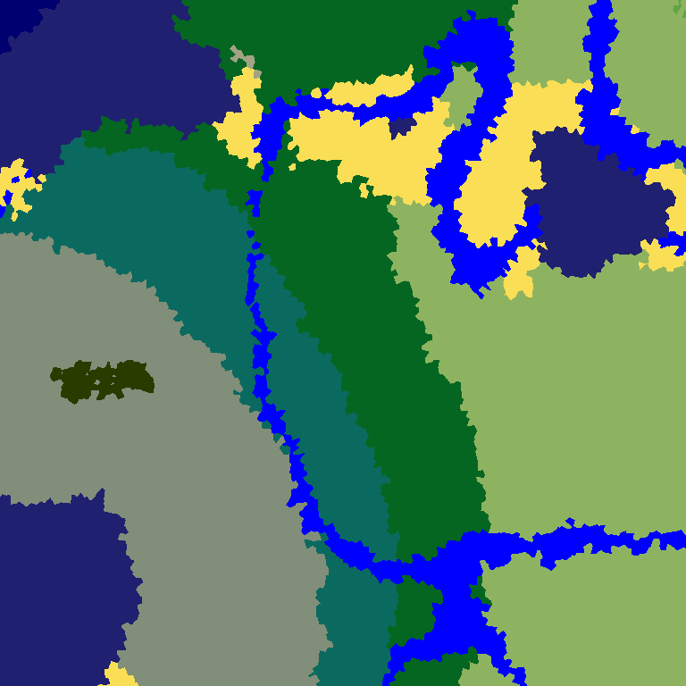
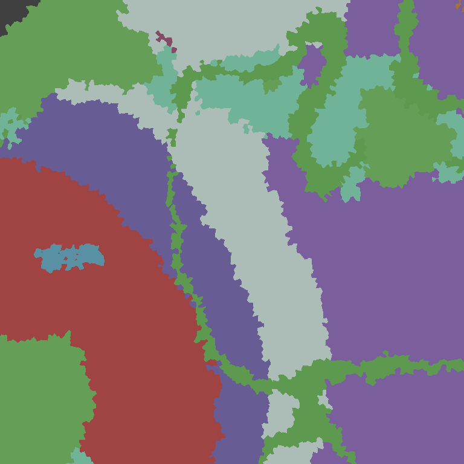
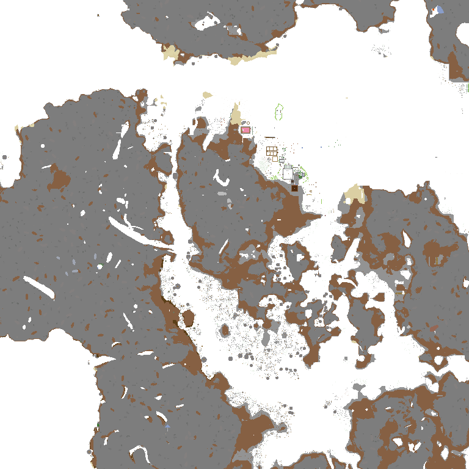
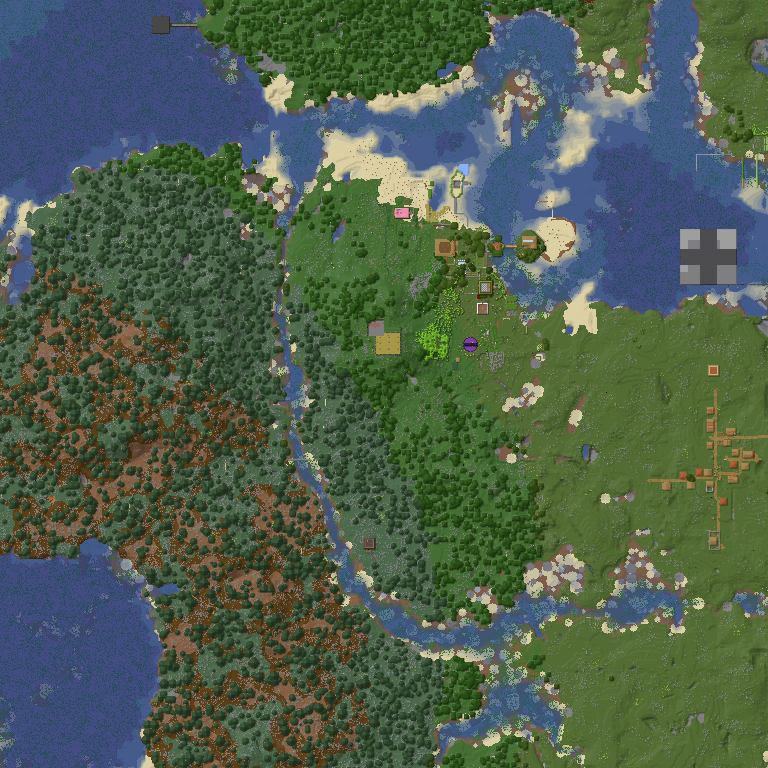
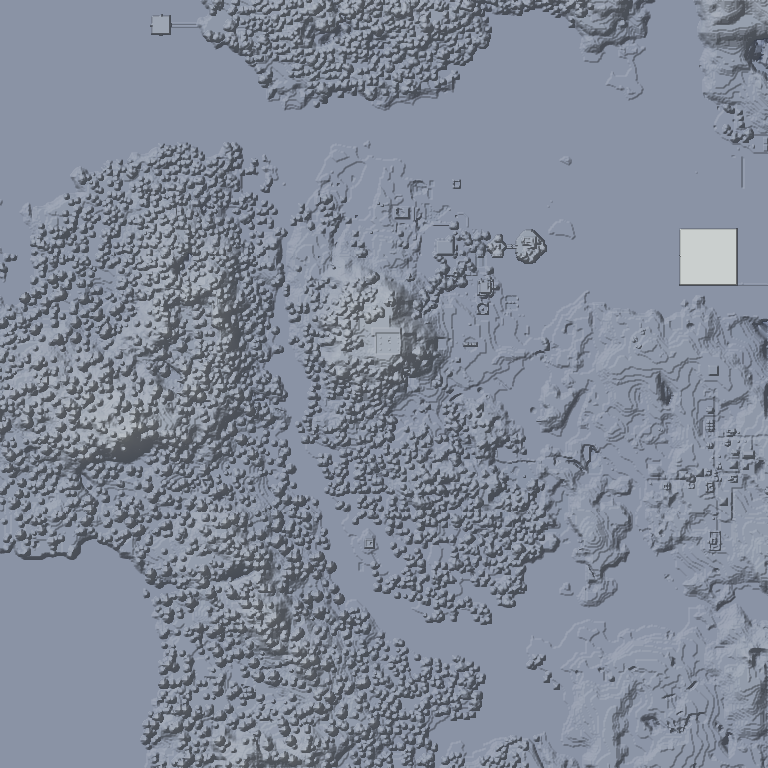
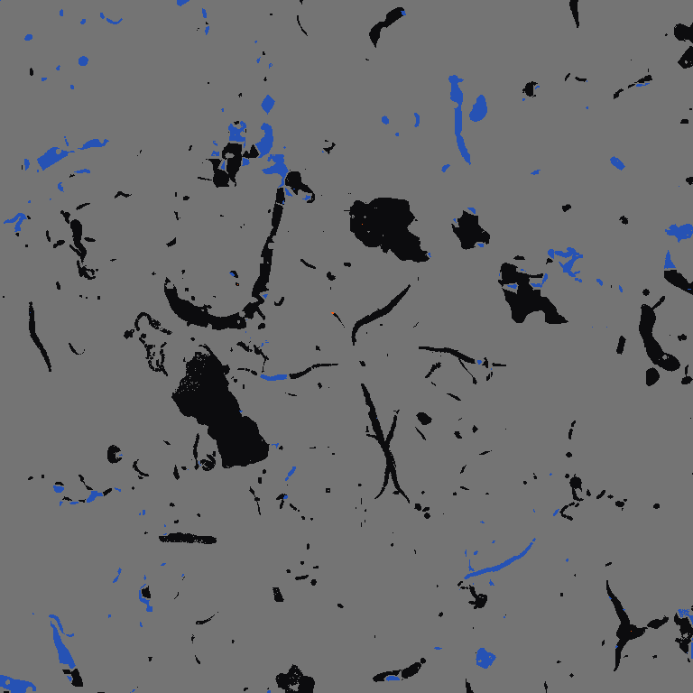

# bedrock-render

[English](README.md) | [简体中文](README.zh-CN.md)

`bedrock-render` is a tile renderer for Minecraft Bedrock worlds. It depends on
`bedrock-world` for Bedrock LevelDB, NBT, chunk, subchunk, height, and biome
queries. Rendering, palettes, tile planning, image encoding, cancellation,
threading, previews, and benchmarks live in this separate crate so the world
parser remains lightweight.

This repository is designed to be checked out independently. The current MSRV is
Rust 1.88, and the default feature set includes `async`, `webp`, and `gpu`.
CPU-only consumers can build with `--no-default-features` and opt into the image
formats they need.

## Design

- Rendering is always an X/Z plane. `Y` is only a sampling parameter.
- Tiles are controlled by `RenderLayout`. The default layout is `16x16` chunks
  per tile, one block per pixel, producing a `256x256` image. Larger
  `blocks_per_pixel` values keep the same world area but render lower-detail
  images for fast large-world previews.
- Arbitrary rectangular chunk regions are supported through `ChunkRegion`.
- Web-map paths are deterministic and cache-safe:
  `<world>/<signature>/r<renderer>-p<palette>/<dimension>/<mode>/<layout>/<tile_x>/<tile_z>.<ext>`.
- Tile batches use bounded worker threads. `Auto` resolves from the selected
  execution profile: `Export` uses host logical CPUs, `Interactive` caps work to
  a smaller foreground-safe pool. Explicit thread counts support `1..=512`.
- Web-map export uses a global chunk-bake queue, per-wave dynamic memory budget,
  parallel tile compose/encode, and a bounded MPMC writer queue so CPU workers
  are not serialized behind `fs::write`.
- Region/web tile rendering uses one shared chunk-to-region coordinate helper
  for direct tiles, shared bakes, streaming sessions, and GPU preparation. Trace
  logs report copied/out-of-bounds region chunks and missing region samples so
  chunk-level placement bugs can be separated from parser data issues.
- Interactive frontends should create one `MapRenderSession` per opened world.
  A session holds the renderer, tile cache, and diagnostics context so panning
  and zooming do not reopen the world or rebuild cache state for every batch.
- Editing is explicit. Use `bedrock_render::editor::MapWorldEditor` only after
  the user has entered write mode; normal render sources remain read-only.
  Mutating editor calls return `MapEditInvalidation` so frontends can refresh
  metadata, overlays, affected chunks, and tile caches deterministically.
- `RenderMemoryBudget::Auto` uses a bounded cache budget for chunk bakes and
  export waves. `FixedBytes` and `Disabled` are available for offline tooling.
- Long operations support explicit cancellation and progress callbacks.

## Render Modes

- `RenderMode::Biome { y }`: biome color map sampled at the requested Y layer.
- `RenderMode::RawBiomeLayer { y }`: diagnostic biome-id color map.
- `RenderMode::LayerBlocks { y }`: fixed block layer map at world Y.
- `RenderMode::SurfaceBlocks`: main top-down terrain map. Each X/Z column is
  sampled from actual loaded blocks, not raw Data2D/Data3D/Legacy heightmap
  values. It applies biome tint, blends thin overlays, and blends transparent
  water over the solid block below.
- `RenderMode::HeightMap`: height gradient from the same computed surface
  columns used by terrain rendering.
- `RenderMode::RawHeightMap`: diagnostic height gradient from raw Bedrock
  Data2D/Data3D/Legacy heightmap records.
- `RenderMode::CaveSlice { y }`: fixed Y cave diagnostic map for air/solid/water/lava.

`SurfaceBlocks` and the default `HeightMap` no longer trust saved heightmaps as
the rendering fact. `bedrock-world` computes canonical visual column samples by
top-down scanning modern paletted subchunks, legacy subchunks, or
`LegacyTerrain`; the renderer then only bakes colors, computed heights, relief
heights, and water depths from that single contract. Raw height records remain
available through `RawHeightMap` for diagnostics. Missing chunks or empty
terrain are transparent, not gray map pixels. Fixed Y rendering remains
available through `LayerBlocks { y }`.
Unknown blocks are rendered as opaque purple diagnostic pixels. Missing chunks,
missing height maps, and empty terrain are transparent and counted separately in
`RenderDiagnostics`.

Old Bedrock/Pocket Edition worlds are supported through
`bedrock-world::RenderChunkData::legacy_terrain` and
structured `legacy_biomes`. For pure `LegacyTerrain` chunks, `SurfaceBlocks` and
`HeightMap` use the fixed `0..=127` height range, while `LayerBlocks` and
`CaveSlice` sample legacy numeric block IDs directly. Common 0.16 numeric IDs
are mapped to modern `minecraft:*` names; unknown IDs render through the normal
unknown-block diagnostic path. If a transition chunk contains both
`LegacyTerrain` and `SubChunkPrefix`, subchunk block data is preferred and
legacy terrain is used only as a fallback. Legacy biome RGB values take
priority over old Data2D/Data3D biome IDs and drive
`Biome` output and grass/foliage tint; `RawBiomeLayer` uses the saved biome ID
when the palette knows it and falls back to saved RGB for unknown old IDs.
Real legacy payloads are decoded as `[biome_id, red, green, blue]`, while
`legacy_biome_colors` remains only a compatibility `0x00RRGGBB` view. Water
keeps the normal water-tint path and does not use legacy grass RGB.

Renderer cache version `48` invalidates tiles created before the single
canonical visual surface sampler. `RenderOptions::default()` now bypasses the
tile cache; set `cache_policy: RenderCachePolicy::Use` explicitly for session
or export paths that should read/write cached images.

## API Sketch

```rust
use std::sync::Arc;
use bedrock_render::{
    ChunkRegion, ImageFormat, MapRenderer, RenderExecutionProfile, RenderLayout,
    RenderMemoryBudget, RenderMode, RenderOptions, RenderPalette, RenderThreadingOptions,
};

let renderer = MapRenderer::new(Arc::new(world), RenderPalette::default());
let region = ChunkRegion::new(dimension, -32, -32, 31, 31);
let layout = RenderLayout {
    chunks_per_tile: 16,
    blocks_per_pixel: 1,
    pixels_per_block: 1,
};

let tiles = renderer.render_region_tiles_blocking(
    region,
    RenderMode::HeightMap,
    layout,
    RenderOptions {
        format: ImageFormat::WebP,
        threading: RenderThreadingOptions::Auto,
        execution_profile: RenderExecutionProfile::Export,
        memory_budget: RenderMemoryBudget::Auto,
        ..RenderOptions::default()
    },
)?;
```

For examples and tools, prefer `bedrock_world::BedrockWorld::open_blocking` or
`BedrockWorld::open` instead of constructing a LevelDB storage handle directly.
That enables automatic detection of old LevelDB `LegacyTerrain` worlds and
read-only `chunks.dat` worlds.

## Editing Facade

`bedrock_render::editor` is the v0.2.0 writable boundary for map viewers and
tooling. It re-exports the common `bedrock-world` map/global/HSA/actor/block
entity/heightmap/biome types and wraps them in a small render-aware facade.
Use it for common map editor actions; call `bedrock-world` directly when a tool
needs lower-level Bedrock records or custom validation.

```rust
use bedrock_render::editor::{MapWorldEditor, WorldScanOptions};

let editor = MapWorldEditor::open_writable("path/to/minecraftWorld")?;
let hsa = editor.scan_hsa_records(WorldScanOptions::default())?;

let invalidation = editor.delete_hsa_for_chunk(chunk_pos)?;
if invalidation.refresh_overlays() {
    // reload overlays for the current viewport
}
if invalidation.clear_tile_cache() {
    // discard cached tiles covering invalidation.affected_chunks()
}
```

Write paths should still be guarded by an application-level confirmation step.
After a successful edit, increment UI generations before scheduling overlay or
tile reload work so stale background results cannot repaint the old state.

## Streaming Session API

`MapRenderSession` is the high-performance path for GPUI and other interactive
map viewers. It streams tile events as work completes, reuses the world handle
and tile cache, supports cancellation, and can cull missing chunks with the new
`bedrock-world` render-index APIs before baking.

```rust
use std::sync::Arc;
use bedrock_render::{
    ChunkRegion, ImageFormat, MapRenderSession, MapRenderSessionConfig,
    MapRenderer, RenderCachePolicy, RenderCancelFlag, RenderExecutionProfile,
    RenderLayout, RenderMode, RenderOptions, RenderPalette, RenderTilePriority,
    TileStreamEvent,
};

let renderer = MapRenderer::new(Arc::new(world), RenderPalette::default());
let session = MapRenderSession::new(
    renderer,
    MapRenderSessionConfig {
        cache_root: "target/bedrock-render-cache".into(),
        world_id: "viewer".into(),
        world_signature: "leveldb-manifest-and-leveldat-signature".into(),
        cull_missing_chunks: true,
        ..MapRenderSessionConfig::default()
    },
);

let layout = RenderLayout::default();
let region = ChunkRegion::new(dimension, -32, -32, 31, 31);
let planned_tiles = MapRenderer::plan_region_tiles(region, RenderMode::SurfaceBlocks, layout)?;
let cancel = RenderCancelFlag::new();

session.render_web_tiles_streaming_blocking(
    &planned_tiles,
    RenderOptions {
        format: ImageFormat::WebP,
        execution_profile: RenderExecutionProfile::Interactive,
        cache_policy: RenderCachePolicy::Use,
        cancel: Some(cancel.clone()),
        priority: RenderTilePriority::DistanceFrom { tile_x: 0, tile_z: 0 },
        ..RenderOptions::default()
    },
    |event| {
        match event {
            TileStreamEvent::Cached { planned, encoded } => {
                // Decode or hand encoded bytes to the UI image cache.
            }
            TileStreamEvent::Rendered { planned, tile } => {
                // Present tile.rgba immediately and keep tile.encoded for cache.
            }
            TileStreamEvent::Failed { planned, error } => {
                eprintln!("tile failed: {error}");
            }
            TileStreamEvent::Progress(progress) => {
                eprintln!("tiles {}/{}", progress.completed_tiles, progress.total_tiles);
            }
            TileStreamEvent::Complete { diagnostics, stats } => {
                eprintln!("cache hits={} gpu={:?}", stats.cache_hits, stats.resolved_backend);
            }
        }
        Ok(())
    },
)?;
```

### Migration: blocking batch to cancellable streaming

Legacy callers that used `render_web_tiles_blocking` usually waited for an
entire batch before updating UI:

```rust
renderer.render_web_tiles_blocking(&planned_tiles, options, |planned, tile| {
    write_tile(planned, tile)?;
    Ok(())
})?;
```

Prefer a long-lived session and stream tile events into the frontend:

```rust
let session = MapRenderSession::new(renderer, MapRenderSessionConfig::default());
let cancel = RenderCancelFlag::new();
session.render_web_tiles_streaming_blocking(
    &planned_tiles,
    RenderOptions {
        cancel: Some(cancel),
        cache_policy: RenderCachePolicy::Use,
        ..options
    },
    |event| {
        enqueue_tile_event(event)?;
        Ok(())
    },
)?;
```

The old batch APIs remain available for export tools, but new interactive code
should treat the session streaming API as the primary entry point.

The `render_streaming_session` example demonstrates the same event flow against
a local world:

```text
cargo run --example render_streaming_session -- <world_path>
```

## Preview Tool

The preview example generates seven atlas PNGs plus web-map tile folders:

```text
cargo run --example render_preview --features png
```

Optional arguments:

```text
render_preview <world_path> <output_dir> <center_tile_x> <center_tile_z> \
  <viewport_tiles> <layer_y> <cave_y> <chunks_per_tile>
```

Preview output layout:

```text
<output_dir>/
  biome-viewport.png
  raw-biome-viewport.png
  layer-y64-viewport.png
  surface-viewport.png
  heightmap-viewport.png
  raw-heightmap-viewport.png
  cave-y32-viewport.png
  web-tiles/sample/signature/r2-p1/overworld/heightmap/16c-1bpp/25/12.png
```

## Web Map Export

`render_web_map` exports WebP tiles plus a self-contained static HTML viewer.
It is intended for validating the renderer and for generating shareable web-map
artifacts without requiring GPUI or a CDN.
When `--region` is omitted, the example discovers and renders the loaded chunk
bounds for each selected dimension.

```text
cargo run --example render_web_map -- \
  --world ../bedrock-world/tests/fixtures/sample-bedrock-world \
  --out target/bedrock-web-map \
  --dimensions overworld,nether,end \
  --mode surface,heightmap,biome,layer \
  --chunks-per-tile 16 \
  --chunks-per-region 32 \
  --blocks-per-pixel 4 \
  --threads auto \
  --profile export \
  --memory-budget auto \
  --pipeline-depth 256 \
  --tile-batch-size auto \
  --writer-threads 2 \
  --write-queue-capacity 256 \
  --stats \
  --force
```

Output layout:

```text
target/bedrock-web-map/
  viewer.html
  map-layout.json
  map-data.js
  tiles/<dimension>/<mode>/<layout>/<tile_z>/<tile_x>.webp
```

`map-layout.json` is the automatically generated map layout for tools and
external frontends. `map-data.js` embeds only the minimal layout constants and
dynamically provides `tileBounds()`, `tileId()`, and `tilePath()`. Tile locations
are derived from the fixed
`tiles/<dimension>/<mode>/<layout>/<tile_z>/<tile_x>.webp` rule, so the HTML
viewer can load the data as a normal script from `file://` without using
`fetch()` or hitting browser CORS restrictions. Export writes `viewer.html`,
`map-layout.json`, and `map-data.js` before opening and scanning the world; as
dimension bounds are discovered and each mode finishes, `map-layout.json` and
`map-data.js` are refreshed with updated layout and stats. The viewer
periodically reloads `map-data.js` and retries visible tiles, so images appear
incrementally while export is still running.
It supports dimension switching, mode switching, drag panning, wheel zoom, tile
coordinates, and load-error reporting. For large
worlds, use `--region` for a bounded export or increase `--blocks-per-pixel`
before exporting the whole loaded chunk bounds. `--profile export --threads auto`
is the recommended default for 8-core/16-thread machines. Use
`--profile interactive` for UI-like previews, and use a fixed thread value up to
512 only for offline exports where the storage device can keep up. `--stats`
prints planned tiles, unique chunks, baked chunks, bake/encode/write time, cache
hits, and peak cache bytes so CPU under-utilization can be traced to I/O,
encoding, or chunk baking. Missing chunks, missing
subchunks, and unloaded fixed-Y areas are transparent. Opaque purple pixels
indicate an actual block name that was read from the world but had no palette
mapping.

## External Palettes

The default palette is embedded in the crate and in compiled binaries. It ships
with two auditable JSON sources:

```text
data/colors/bedrock-block-color.json
data/colors/bedrock-biome-color.json
```

`RenderPalette::default()` builds from the embedded JSON sources, so normal
rendering does not require external palette files. The JSON files remain
available through `RenderPalette::builtin_block_color_json()` and
`RenderPalette::builtin_biome_color_json()` for auditing and tooling.
The built-in data is maintained inside this project for Bedrock rendering; the
loader also understands legacy object-map palette JSON so applications can
import their own licensed color data without depending on another renderer.

For projects that have their own licensed color data, `RenderPalette` also
supports additional user-provided JSON:

```text
--palette-json target/bedrock-block-color.json
--palette-json target/bedrock-biome-color.json
```

JSON is an import/override format. Tintable blocks use mask colors in the block
source and receive their final render color from biome tint data. The JSON
loader accepts combined objects
with `schema_version` / `sources` / `blocks` / `defaults` / `biomes`, object maps such as
`{"minecraft:stone":"#7d7d7d"}`, arrays with `name` / `id` plus `color`, and
legacy multi-texture object-map shapes for local user-provided reference data.

Palette source maintenance commands:

```text
cargo run --example palette_tool -- audit --check
cargo run --example palette_tool -- generate-clean-room --check
cargo run --example palette_tool -- normalize --check
```

Source policy and public references are documented in
[docs/PALETTE_SOURCES.md](docs/PALETTE_SOURCES.md).

Latest local reference-palette smoke run:

```text
cargo run --example render_web_map -- \
  --world ../bedrock-world/tests/fixtures/sample-bedrock-world \
  --out target/bedrock-web-map-ref-palette \
  --region 0,0,15,15 \
  --mode surface,heightmap,biome,layer \
  --y 64 \
  --palette-json target/bedrock-block-color.json \
  --palette-json target/bedrock-biome-color.json \
  --force

loaded palette JSON target\bedrock-block-color.json: block_colors=1211 biome_colors=0 skipped=0
loaded palette JSON target\bedrock-biome-color.json: block_colors=0 biome_colors=88 skipped=0
overworld surface tiles=1 missing=0 transparent=0 unknown=0
overworld layer-y64 tiles=1 missing=0 transparent=12544 unknown=0
```

Latest local debug preview run:

```text
cargo run --example render_preview --features png
surface diagnostics: missing_chunks=0 missing_heightmaps=0 unknown_blocks=0 fallback_pixels=0
preview output: target/bedrock-render-preview
```

Latest local WebP web-map smoke run:

```text
cargo run --example render_web_map -- \
  --world ../bedrock-world/tests/fixtures/sample-bedrock-world \
  --out target/bedrock-web-map \
  --region 0,0,15,15 \
  --mode surface,heightmap,biome,layer \
  --threads auto \
  --tile-batch-size auto \
  --writer-threads 2 \
  --write-queue-capacity 64 \
  --force

Generated viewer.html, map-layout.json, map-data.js, and WebP tiles for overworld/nether/end.
LayerBlocks transparent pixels are expected for unloaded fixed-Y areas.
```

## Rendered Examples

These images are generated by the preview tool with the current default
palette. The terrain view references BedrockMap-style top-down map behavior
while remaining part of this standalone public renderer.

### `Biome { y }`

Biome colors sampled on an X/Z plane at the configured Y layer.



### `RawBiomeLayer { y }`

Diagnostic biome-id map. Unknown or sparse ids are intentionally visible.



### `LayerBlocks { y }`

Fixed world-Y block layer rendered as an X/Z plane. This is not a side section.



### `SurfaceBlocks`

Primary top-down terrain map. Each X/Z column is sampled from the real loaded
block data top-down, applies biome tint, and blends transparent water with the
block below. Lightweight height-normal shading is enabled by default so terrain
does not look completely flat. `SurfaceRenderOptions::block_boundaries` adds a
subtle 2D per-block outline and height-contact shadow so cliffs, paths, and
same-color blocks remain readable without switching to a 2.5D view. Use
`HeightMap` for computed surface elevation and `RawHeightMap` for saved raw
heightmap diagnostics.



### `HeightMap`

Height gradient derived from the same computed surface column used by
`SurfaceBlocks`. Raw Data2D/Data3D/Legacy heightmap records are available through
`RawHeightMap` when you need to debug saved height hints.



### `CaveSlice { y }`

Fixed Y cave diagnostic map for air, solid blocks, water, and lava.



## Performance Model

- `MapRenderer<S = Arc<dyn WorldStorage>>` supports both the compatibility
  dynamic storage path and typed storage such as
  `MapRenderer<BedrockLevelDbStorage>`. Tools that own the backend should prefer
  typed storage to remove dynamic dispatch from renderer/world hot paths.
- `Biome`, `RawBiomeLayer`, `RawHeightMap`, `LayerBlocks`, and `CaveSlice`
  prefetch only the chunk records needed by the tile.
- `SurfaceBlocks` and `HeightMap` load the relevant subchunks and compute a
  canonical `16x16` surface column grid from actual blocks. Raw height mismatches
  are kept in diagnostics so bad saved height hints can be isolated without
  corrupting the rendered map.
- Missing chunks or columns with no real surface block are counted in diagnostics
  and emitted as absent terrain.
- Subchunk access uses `SubChunk::block_state_at(local_x, local_y, local_z)` so
  renderer code does not duplicate palette index math.
- Web export uses a region-first bake pipeline. `--chunks-per-region` controls
  the bake cache unit; `32` is the default for large exports, while `16` is
  better for small bounded validation runs or lower interactive latency.
- Web export does not keep every baked region for the full map resident at once.
  The renderer splits baking, composition, and writing into waves bounded by
  `--memory-budget`. `--pipeline-depth` and `--write-queue-capacity` only bound
  encoded tiles waiting for disk writes.
- `SurfaceBlocks` uses chunk bake: each chunk is reduced from
  `bedrock-world` column samples to a `16x16` terrain image first, then region
  planes and WebP tiles are assembled from baked chunk pixels.
- Single-tile bake rendering uses `bedrock-world` exact batch loading for all
  chunks covered by the tile. The benchmark report should show
  `prefix_scans=0` and one `exact_get_batches` entry for the sampled surface
  region, keeping repeated point lookups out of the render loop.
- The static viewer uses `RenderLayout` auto-scaling. Small worlds default to
  full detail; larger worlds can use 2/4/8 blocks per pixel without changing the
  visible tile coverage.
- Cache keys include world path hash, world file signature, renderer version,
  palette version, dimension, render mode, Y layer, and layout. All-transparent
  stale cached tiles are rejected by the UI and regenerated.
- `ImageFormat::Rgba` is the lowest-latency UI path. WebP/PNG are intended for
  cache/export/preview paths.
- `RenderOptions::gpu` controls GPU backend, fallback policy, diagnostics, and
  compose scheduling. `max_in_flight=0`, `batch_size=0`, `batch_pixels=0`,
  `submit_workers=0`, `readback_workers=0`, `buffer_pool_bytes=0`, and
  `staging_pool_bytes=0` use profile-aware defaults; export workloads allow
  larger GPU batches than interactive workloads.
- `RenderOptions::cpu` controls bounded CPU queue depth and chunk batch sizing,
  while `RenderOptions::priority` lets interactive sessions render the current
  viewport center before distant tiles.
- GPU compose runs with bounded concurrent in-flight jobs on one `wgpu` device.
  Direct tiles, shared-bake tiles, web map tiles, and streaming sessions all use
  the same GPU decision path. Interactive sessions now group multiple cache
  misses by default while still streaming ready tiles as soon as they finish.
  Web/region ready tiles submit through true batches, so `batch_size` and
  `batch_pixels` affect submit/readback counts. Failed GPU tiles fall back to CPU
  unless `RenderGpuFallbackPolicy::Required` is set; stats expose backend/adapter
  identity, supported/skipped/fallback counts, world load/decode timing, region
  copy timing, GPU prepare/upload/dispatch/readback timing, batch submit/readback
  counts, uploaded/readback bytes, and buffer/staging pool reuse.
- The static web-map example writes WebP tiles under
  `tiles/<dimension>/<mode>/<layout>/<tile_z>/<tile_x>.webp`; it does not leave
  gaps between tiles and uses transparent pixels for absent world data.
- Viewer integrations can start from the world's `level.dat` spawn point,
  support dimension/custom-dimension switching, and store WebP web-map tiles
  under an application cache directory.

## Tests and Benchmarks

```text
cargo fmt --all -- --check
cargo clippy --all-features --all-targets -- -D warnings
cargo test --all-features
cargo test --no-default-features
cargo doc --no-deps --all-features
cargo rustdoc --lib --all-features -- -D missing_docs
cargo bench --bench render --all-features
```

The default benchmark suite measures tile rendering, chunk baking, small batch
behavior, and v0.2.0 editor facade scans. Full web-map export benchmarks are
opt-in:

```text
$env:BEDROCK_RENDER_FULL_BENCH='1'
cargo bench --bench render --all-features
Remove-Item Env:\BEDROCK_RENDER_FULL_BENCH
```

More details are in [docs/API.md](docs/API.md), [docs/TESTING.md](docs/TESTING.md),
and [docs/BENCHMARKS.md](docs/BENCHMARKS.md).

## Current Limits

- V1 does not implement entity markers or labels.
